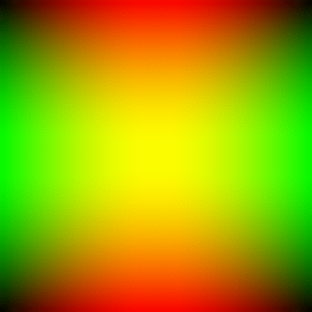
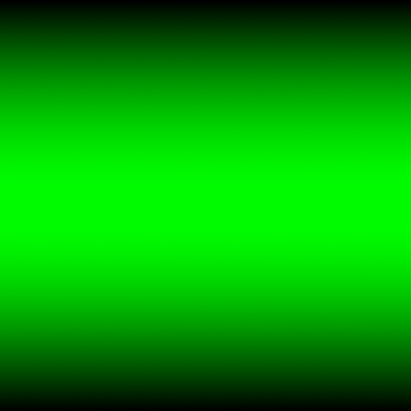

# Making Our First Animation

We learned how to read text from the keyboard. We learned how to read a whole line of text from the keyboard. We figured out how to open a file and read it line by line. And we know how to write text into a file. We have already created our fist image.

How hard can it be to create an animation?

It isn't that hard because we can easily make a [flip book](https://en.wikipedia.org/wiki/Flip_book) style animation using the [GIF](https://en.wikipedia.org/wiki/GIF) file format.

Our goal is to create an image that looks like the one below.



The image is composed of three different channels or colors. The channels are red, green, and blue. To help you visualize how the image is created let's look at each color channel separately. Look at the images critically. How do the images change horizontally (the x direction) and vertically (the y direction)? Is the color the same all the way across? Does the color change as you move from the top to the bottom?


### Debugging Image, Red Channel Only


Look at how the red color changes as we move from the left edge to the right edge of the image. Notice that each row of pixels starts as black (no red, no green, no blue) and gradually turns into read (all red, no green, no blue). The color smoothly changes with no visible bands or steps.

### Debugging Image, Green Channel Only



Similar to the red image, the green image changes. The green images changes as we move from the top edge to the bottom edge of the image. Notice how each column of pixels starts as green (no red, all green, no blue) and gradually changes to black (no red, no green, no blue). The color smoothly changes with no visible bands or steps just like the red image.

### Debugging Image, Blue Channel Only


Unlike the red and green image, the blue image is the same color at every single pixel. Look in the center, at the left edge, the right edge, the top, and bottom edge and you'll see the same shade of blue. This means that the color is not changing and it is staying constant (same red, same green, same blue) at every pixel.

### Sample Output Image, All Channels


By combining the three channels together and combining the images into a GIF, a beautiful animated gradient is created.

In this exercise, we shall use the C++ math library's [`sin()`](https://en.cppreference.com/w/cpp/numeric/math/sin) function to help us smoothly change the red and green channels. Additionally, the value for pi is defined as `M_PI` when you `#include <cmath>`.

Notice that in the red-only and green-only images that the color intensity does not linearly change. The colors smoothly change like a sine wave, starting from 0.0 and slowly increasing to 1.0, then slowly returning to 0.0. We do this by mapping the width (red channel) or the height (green channel) to radians from 0 to pi (or 0 to 180 degrees).

We must use radians because the standard C++ library's `sin()` function uses [radians](https://en.wikipedia.org/wiki/Radian). (We could easily convert back and forth from radians to [degrees](https://en.wikipedia.org/wiki/Degree_(angle)) but we do not need to.)

For the red channel, the left edge of the image will represent 0 radians. The right edge of the image will represent pi radians. Since the image is 512 pixels wide, we divide pi by 512 to find the _step_. This will help us figure out the correct number of radians to use to calculate the color across the image or down the image.

To make programming the exercise a little simpler, we will write a function named `std::vector<double> BuildSineLookupTable(int image_width)`. This function will take the image width and calculate a `std::vector<double>` which contains all the values of `sin()` that we will need for our image.

The function stores the results in a [lookup table](https://en.wikipedia.org/wiki/Lookup_table). First declare a `std::vector<dobule>` for the look up table and calculate the step size by dividing pi by the width of the image. Next, use a loop to calculate all the values of sine that you will need and store them in the lookup table. Finally, return the lookup table to the caller.

```c++
std::vector<double> lookup_table;
double radian_step = M_PI / double(image_width);
for (int column = 0; column < image_width; column++) {
    double value = sin(radian_step * column);
    lookup_table.push_back(value);
}
```

The same lookup table can be used for the green channel.

To animate the red and green channel, we will use modulo arithmetic ([remember the `%` operator?](https://www.learncpp.com/cpp-tutorial/5-3-modulus-and-exponentiation/)).

The blue channel blinks on and off which causes the other colors to appear to pulse and change. For any given image in our animation, the blue color is constant. It does change between images. We calculate the blue value by first figuring out the blue step.
```c++
double blue_step = M_PI / double(kNumberOfImages);
```
Then for each image, the blue color is defined as
```c++
blue = sin(blue_step * current_image);
```
where `current_image` is the number that represents the frame we are currently working on. (See example loop below.)

We will need 10 images to make the animation and to make it appear as though the animations are on a loop, we want to last frame to end in a position that makes it appear that the there is perpetual motion. A trivial solution is take the image width and divide it by the number of images and use this value as a stepping value to start our lookup process in our sine lookup table.

This sounds more complicated that it is.

We will need three loops. The outer loop sets up the `Magick::Image image` variable for the current frame and calculates the

```c++
std::vector<Magick::Image> images;
int row_col_step = kImageWidth / kNumberOfImages;
for (int current_image = 0; current_image < kNumberOfImages; current_image++) {
    // Initialize the current image
    Magick::Image image(Magick::Geometry(kImageWidth, kImageHeight), white);
    // Calculate the blue color for the given image
    blue = sin(blue_step * current_image);
    for (int column = 0; column < image.columns(); column++) {
        for (int row = 0; row < image.rows(); row++) {
            int current_step = (current_image * row_col_step);
            double red =
                sine_lookup_table.at((row + current_step) % kImageWidth);
            double green =
                sine_lookup_table.at((column + current_step) % kImageHeight);
            Magick::ColorRGB color{red, green, blue};
            image.pixelColor(column, row, color);
        }
    }
    images.push_back(image);
}
```

Notice that we are using `% kImageHeight`. This ensures that we can lookup values from the middle of the `sine_lookup_table` and wrap around from the end to the beginning. This will give us the appearance that the image is moving since each frame is _shifted_.

## Requirements

Use GraphicsMagick to create an series of images as described above. Store each image in a `std::vector<GraphicsMagick::Image>`.

Review the C++ source files and identify all the TODOs. Remember you can always check your application using `make test`.

To compile your program, you use the `make` command. A Makefile is provided for this exercise.

The Makefile has the following targets:
  
* all: builds the project
* clean: removes object and dependency files
* spotless: removes everything the clean target removes and all binaries
* format: outputs a [`diff`](https://en.wikipedia.org/wiki/Diff) showing where your formatting differes from the [Google C++ style guide](https://google.github.io/styleguide/cppguide.html)
* lint: output of the [linter](https://en.wikipedia.org/wiki/Lint_(software)) to give you tips on how to improve your code
* header: check to make sure your files have the appropriate header
* test: run tests to help you verify your program is meeting the assignment's requirements. This does not grade your assignment.
* unittest: run unit tests to verify parts of your program performs according to the instructor supplied unit tests.

## Don't Forget

Please remember that:

- You need to put a header in every file.
- You need to follow the [Google C++ Style Guide](https://google.github.io/styleguide/cppguide.html).
- Remove the `TODO` comments.

## Testing Your Code

Computers only ever do exactly what they are told, exactly the way they are told it, and never anything else. Testing is an important process to writing a program. You need to test for the program to behave correctly and test that the program behaves incorrectly in a predictable way.

As programmers we have to remember that there are a lot of ways that we can write the wrong program and only one to a few ways to write the correct program. We have to be aware of [cognitive biases](https://en.wikipedia.org/wiki/List_of_cognitive_biases) that we may exercise that lead us to believe we have correctly completed our program. That belief may be incorrect and our software may have errors. [Errors in software](https://www.wired.com/2005/11/historys-worst-software-bugs/) may lead to loss of [life](https://www.nytimes.com/2019/03/14/business/boeing-737-software-update.html), [property](https://en.wikipedia.org/wiki/Mariner_1), [reputation](https://en.wikipedia.org/wiki/Pentium_FDIV_bug), or [all of the above](https://en.wikipedia.org/wiki/2009%E2%80%9311_Toyota_vehicle_recalls).

### Test strategy

Start simple, and work your way up. Good tests are specific, cover a broad range of fundamentally different possibilities, can identify issues quickly, easily, and directly, without need for much set up, and can almost be diagnosed by inspection if the code fails to execute the test correctly.

## Example Output

Please ensure your program's output is identical to the example below.

```
$ make unittest
set -e; clang++ -MM -g -O3 -Wall -pipe -std=c++17 -D LINUX -I/usr/include/GraphicsMagick -D AMD64 animated_gradient_functions.cc \
| sed 's/\(animated_gradient_functions\)\.o[ :]*/\1.o animated_gradient_functions.d : /g' > animated_gradient_functions.d; \
[ -s animated_gradient_functions.d ] || rm -f animated_gradient_functions.d
set -e; clang++ -MM -g -O3 -Wall -pipe -std=c++17 -D LINUX -I/usr/include/GraphicsMagick -D AMD64 animated_gradient.cc \
| sed 's/\(animated_gradient\)\.o[ :]*/\1.o animated_gradient.d : /g' > animated_gradient.d; \
[ -s animated_gradient.d ] || rm -f animated_gradient.d
rm: cannot remove 'unittest': No such file or directory
rm: cannot remove 'test_detail.json': No such file or directory
make: [Makefile:143: cleanunittest] Error 1 (ignored)
clang++ -g -O3 -Wall -pipe -std=c++17 -D LINUX -I/usr/include/GraphicsMagick -D AMD64 -c animated_gradient_functions.cc
Running main() from /build/googletest-j5yxiC/googletest-1.10.0/googletest/src/gtest_main.cc
[==========] Running 3 tests from 2 test suites.
[----------] Global test environment set-up.
[----------] 2 tests from HasMatchingFileExtension
[ RUN      ] HasMatchingFileExtension.Exists
[       OK ] HasMatchingFileExtension.Exists (1 ms)
[ RUN      ] HasMatchingFileExtension.NotExist
[       OK ] HasMatchingFileExtension.NotExist (0 ms)
[----------] 2 tests from HasMatchingFileExtension (1 ms total)

[----------] 1 test from BuildSineLookupTable
[ RUN      ] BuildSineLookupTable.Values
[       OK ] BuildSineLookupTable.Values (0 ms)
[----------] 1 test from BuildSineLookupTable (0 ms total)

[----------] Global test environment tear-down
[==========] 3 tests from 2 test suites ran. (1 ms total)
[  PASSED  ] 3 tests.
$ make
set -e; clang++ -MM -g -O3 -Wall -pipe -std=c++17 -D LINUX -I/usr/include/GraphicsMagick -D AMD64 animated_gradient_functions.cc \
| sed 's/\(animated_gradient_functions\)\.o[ :]*/\1.o animated_gradient_functions.d : /g' > animated_gradient_functions.d; \
[ -s animated_gradient_functions.d ] || rm -f animated_gradient_functions.d
set -e; clang++ -MM -g -O3 -Wall -pipe -std=c++17 -D LINUX -I/usr/include/GraphicsMagick -D AMD64 animated_gradient.cc \
| sed 's/\(animated_gradient\)\.o[ :]*/\1.o animated_gradient.d : /g' > animated_gradient.d; \
[ -s animated_gradient.d ] || rm -f animated_gradient.d
clang++ -g -O3 -Wall -pipe -std=c++17 -D LINUX -I/usr/include/GraphicsMagick -D AMD64 -c animated_gradient.cc
clang++ -g -O3 -Wall -pipe -std=c++17 -D LINUX -I/usr/include/GraphicsMagick -D AMD64 -c animated_gradient_functions.cc
clang++ -g -O3 -Wall -pipe -std=c++17 -lGraphicsMagick++ -lGraphicsMagick -o animated_gradient animated_gradient.o animated_gradient_functions.o 
$ ./animated_gradient 
Please provide a path to a file.
$ ./animated_gradient output_file
output_file is missing the required file extension .gif.
$ ./animated_gradient output_file.gif
Image 1...completed.
Image 2...completed.
Image 3...completed.
Image 4...completed.
Image 5...completed.
Image 6...completed.
Image 7...completed.
Image 8...completed.
Image 9...completed.
Image 10...completed.
$ xdg-open output_file.gif
```

In the example above, the image is saved to `output_file.gif`. To view the image, you can use the command `xdg-open output_file.gif`. This will open the image in your default image viewer. You can also view the image in your web browser.
