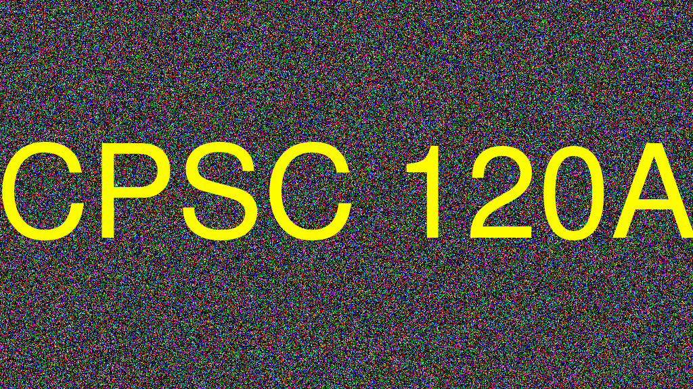

# Beautiful Noise

Computers are machines so they cannot be completely unpredictable. We can create a machine that can generate what appears to be random numbers. This is what we call a [pseudorandom number generator](https://en.wikipedia.org/wiki/Pseudorandom_number_generator). We use _pseudo_ because nothing is _truly_ random when a machine is involved.

If you use an Internet search engine to search for _random number generator in c++_ you will invariably be led to use the functions `rand()` and `srand()`. *Do not use these please. They are of poor quality.*

The functions `rand()` and `srand()` go way back and are part of the [ISO C90 specification](https://en.wikipedia.org/wiki/ANSI_C#C90). For this reason alone, they will never go away. However `rand()` is not a super high quality random number generator. The algorithm it uses is called [Lehmer random number generator](https://en.wikipedia.org/wiki/Lehmer_random_number_generator) or a [Park-Miller random number generator](https://doi.org/10.1145/63039.63042). D.H. Lehmer published the algorithm in 1949. Almost 40 years later, Park & Miller proposed using Lehmer's algorithm in a paper in 1988 because it was easy enough to implement using only integers, worked correctly on a computer with 32 bit integers, and appeared to be random enough after some statistical analysis.

The thinking at the time was that if you're going to go to all the trouble of writing a random number generator, you better pick an algorithm that will work correctly on the computers available at the time. The 1980s were a great period of transition as computers and software libraries standardized around 32 bit integers and 32 bit memory addressing. And in 1985, [IEEE standardized floating point numbers](https://en.wikipedia.org/wiki/IEEE_754) which further boosted interoperability of software. Park & Miller recommended Lehmer's algorithm because by 1988 32 bit integers had become common on the various central processing units used in computers ([Intel 386](https://en.wikipedia.org/wiki/Intel_80386), [Motorola 68020](https://en.wikipedia.org/wiki/Motorola_68020), [System/360](https://en.wikipedia.org/wiki/IBM_System/360) [MIPS](https://en.wikipedia.org/wiki/MIPS_architecture), [VAX](https://en.wikipedia.org/wiki/VAX), [Sparc](https://en.wikipedia.org/wiki/SPARC), [ARM](https://en.wikipedia.org/wiki/ARM_architecture), [PA-RISC](https://en.wikipedia.org/wiki/PA-RISC), etc.). 

Since we're writing programs in the 21st century and there are a lot of applications that need a little bit of unpredictability to make them interesting, let's use a random number generator that isn't old enough to collect Social Security.

The C++ Standard Library has a whole section dedicated to [pseudo-random numbers](https://en.cppreference.com/w/cpp/numeric/random). The library has a quite a few pseudo random number generator engines. We'll use the [Mersenne Twister](https://en.wikipedia.org/wiki/Mersenne_Twister) engine (because I like the sound of the name and it's a good PRNG).

There are many different applications for random numbers and good ones are hard to come by. There's even new PRNGs being invented, such as [PCG](https://www.pcg-random.org/index.html) which was invented by [M.E. O'Neill](https://www.cs.hmc.edu/~oneill/). 

Our PRNG is defined in two files, `make_message_functions.h`. There is a class named `RandomNumberGenerator` which can be used to create a PRNG which will generate `doubles` within a given range. There are three convenience functions which we can use when we just need a random `double`. Their names are somewhat self descriptive.

* `double RandomDouble(double min, double max);`
* `double RandomDouble01();`
* `double RandomDouble11();`
* `bool CoinFlip();`

To learn more about each function or the `RandomNumberGenerator` class, read the inline documentation.

In this exercise, we're going to put together our knowledge about how to work with images, conditions, functions, and loops to create an image that looks like the one below.



The image is an animated [GIF](https://en.wikipedia.org/wiki/GIF). It is constructed from many individual images. In our case, `number_of_images` defines how many images we create. Each image has a background of randomly colored pixels. On top of the random noise, a user defined message is super imposed in yellow text.

To create this image we will need a loop to create `kNumberOfImages` of images. For each image, we will need to use a doubly nested loop to visit each pixel in the image.

Recall that an image has columns (x direction) and rows (y direction). And you can ask an image object how many rows and columns it has. For example:

```c++
    for (int row = 0; row < image.rows(); row++) {
      for (int column = 0; column < image.columns(); column++) {
      	// Each pixel is located at (column, row)
      }
    }
```

For each pixel, generate a random color intensity between 0.0 and 1.0. Flip a coin using the `CoinFlip()` function, to decide which color channels will be assigned the random color intensity.

For example, a randome color intensity can be calculated like so:
```c++
double random_color_intensity = RandomDouble01();
```
To decide if the red channel is assigned the random value, a pattern such as the following can be used:
```c++
double red = 0.0;
if (CoinFlip()) {
  red = random_color_intensity;
}
double green = 0.0;
if (CoinFlip()) {
  green = random_color_intensity;
}
double blue = 0.0;
if (CoinFlip()) {
  blue = random_color_intensity;
}
```
This way, if the coin flip is True, red is assigned the random intensity. If the coin flip is false, red's value remains 0.0.

Remember that each pixel only has one random intensity. The coin flip determines which channels (red, green, blue) are assigned the random intensity.

Once values are assigned for the red, green, and blue channels, create a new ColorRGB variable and assign it to the current pixel. For example,

```c++
ColorRGB pixel_color(red, green, blue);
```

Once all the pixels for an image have been visited, annotate the image with a user defined message. Finally, use `push_back()` to add the image to a vector of images. 

```c++
std::string message = args.at(2);
image.font("Helvetica");
image.fontPointsize(72);
image.fillColor(Magick::Color("yellow"));
image.annotate(message, Magick::CenterGravity);
// push the image into the vector named images
images.push_back(image);
```

Finally, use Graphics Magick's `writeImages()` function to combine all the computed images into a single GIF image file using the file name provided by the computer user on the command line, `output_file_name`.

```c++
std::string output_file_name = args.at(1);
Magick::writeImages(images.begin(), images.end(), output_file_name);
```

## Requirements

Complete the program such that it creates an output image file similar to the ones shown in this README.

Complete any `TODO` comments found in the project.
To compile your program, you use the `make` command. A Makefile is provided for this exercise.

The Makefile has the following targets:
  
* all: builds the project
* clean: removes object and dependency files
* spotless: removes everything the clean target removes and all binaries
* format: outputs a [`diff`](https://en.wikipedia.org/wiki/Diff) showing where your formatting differes from the [Google C++ style guide](https://google.github.io/styleguide/cppguide.html)
* lint: output of the [linter](https://en.wikipedia.org/wiki/Lint_(software)) to give you tips on how to improve your code
* header: check to make sure your files have the appropriate header
* test: run tests to help you verify your program is meeting the assignment's requirements. This does not grade your assignment.
* unittest: run unit tests to verify parts of your program performs according to the instructor supplied unit tests.

## Don't Forget

Please remember that:

- You need to put a header in every file.
- You need to follow the [Google C++ Style Guide](https://google.github.io/styleguide/cppguide.html).
- Remove the `TODO` comments.

## Testing Your Code

Computers only ever do exactly what they are told, exactly the way they are told it, and never anything else. Testing is an important process to writing a program. You need to test for the program to behave correctly and test that the program behaves incorrectly in a predictable way.

As programmers we have to remember that there are a lot of ways that we can write the wrong program and only one to a few ways to write the correct program. We have to be aware of [cognitive biases](https://en.wikipedia.org/wiki/List_of_cognitive_biases) that we may exercise that lead us to believe we have correctly completed our program. That belief may be incorrect and our software may have errors. [Errors in software](https://www.wired.com/2005/11/historys-worst-software-bugs/) may lead to loss of [life](https://www.nytimes.com/2019/03/14/business/boeing-737-software-update.html), [property](https://en.wikipedia.org/wiki/Mariner_1), [reputation](https://en.wikipedia.org/wiki/Pentium_FDIV_bug), or [all of the above](https://en.wikipedia.org/wiki/2009%E2%80%9311_Toyota_vehicle_recalls).

### Test strategy

Start simple, and work your way up. Good tests are specific, cover a broad range of fundamentally different possibilities, can identify issues quickly, easily, and directly, without need for much set up, and can almost be diagnosed by inspection if the code fails to execute the test correctly.

## Example Output

Please ensure your program's output is identical to the example below.

```
$ make
set -e; clang++ -MM -g -O3 -Wall -pipe -std=c++17 -D LINUX -I/usr/include/GraphicsMagick -D AMD64 make_message_functions.cc \
| sed 's/\(make_message_functions\)\.o[ :]*/\1.o make_message_functions.d : /g' > make_message_functions.d; \
[ -s make_message_functions.d ] || rm -f make_message_functions.d
set -e; clang++ -MM -g -O3 -Wall -pipe -std=c++17 -D LINUX -I/usr/include/GraphicsMagick -D AMD64 make_message.cc \
| sed 's/\(make_message\)\.o[ :]*/\1.o make_message.d : /g' > make_message.d; \
[ -s make_message.d ] || rm -f make_message.d
clang++ -g -O3 -Wall -pipe -std=c++17 -D LINUX -I/usr/include/GraphicsMagick -D AMD64 -c make_message.cc
clang++ -g -O3 -Wall -pipe -std=c++17 -D LINUX -I/usr/include/GraphicsMagick -D AMD64 -c make_message_functions.cc
clang++ -g -O3 -Wall -pipe -std=c++17 -lGraphicsMagick++ -lGraphicsMagick -o make_message make_message.o make_message_functions.o 
$ make unittest
rm: cannot remove 'unittest': No such file or directory
rm: cannot remove 'test_detail.json': No such file or directory
make: [Makefile:143: cleanunittest] Error 1 (ignored)
Running main() from /build/googletest-j5yxiC/googletest-1.10.0/googletest/src/gtest_main.cc
[==========] Running 5 tests from 4 test suites.
[----------] Global test environment set-up.
[----------] 2 tests from HasMatchingFileExtension
[ RUN      ] HasMatchingFileExtension.Exists
[       OK ] HasMatchingFileExtension.Exists (0 ms)
[ RUN      ] HasMatchingFileExtension.NotExist
[       OK ] HasMatchingFileExtension.NotExist (0 ms)
[----------] 2 tests from HasMatchingFileExtension (0 ms total)

[----------] 1 test from RandomDouble_01
[ RUN      ] RandomDouble_01.PredictableSeries
[       OK ] RandomDouble_01.PredictableSeries (0 ms)
[----------] 1 test from RandomDouble_01 (0 ms total)

[----------] 1 test from RandomDouble_11
[ RUN      ] RandomDouble_11.PredictableSeries
[       OK ] RandomDouble_11.PredictableSeries (0 ms)
[----------] 1 test from RandomDouble_11 (0 ms total)

[----------] 1 test from CoinFlip
[ RUN      ] CoinFlip.PredictableSeries
[       OK ] CoinFlip.PredictableSeries (0 ms)
[----------] 1 test from CoinFlip (0 ms total)

[----------] Global test environment tear-down
[==========] 5 tests from 4 test suites ran. (0 ms total)
[  PASSED  ] 5 tests.
$ ./make_message 
Please provide a path to a file and a brief message.
$ ./make_message output_image
Please provide a path to a file and a brief message.
$ ./make_message output_image.gif
Please provide a path to a file and a brief message.
$ ./make_message output_image "Hello World"
output_image is missing the required file extension .gif.
$ ./make_message output_image.gif "Hello World"
Your image has 1024 columns (x direction) and 576 rows (y direction).
Image 1...completed.
Image 2...completed.
Image 3...completed.
Image 4...completed.
Image 5...completed.
$ xdg-open output_image.gif
```

In the example above, the image is saved to `output_image.gif`. To view the image, you can use the command `xdg-open output_image.gif`. This will open the image in your default image viewer. You can also view the image in your web browser.
